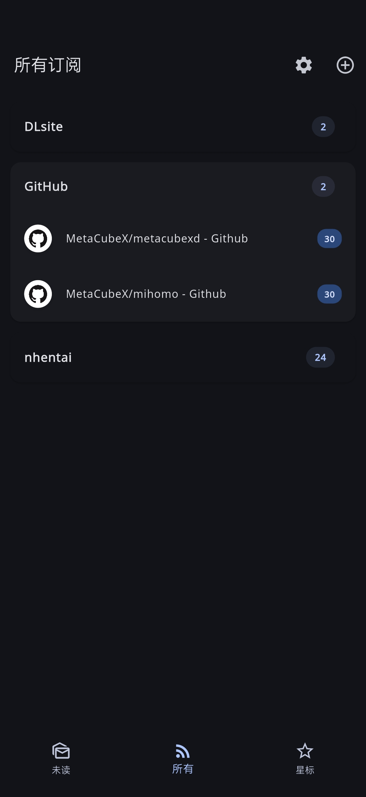
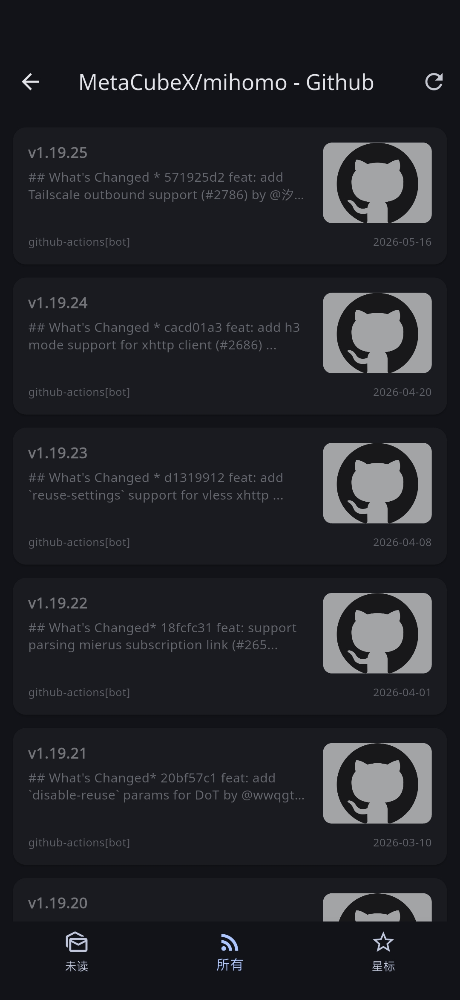
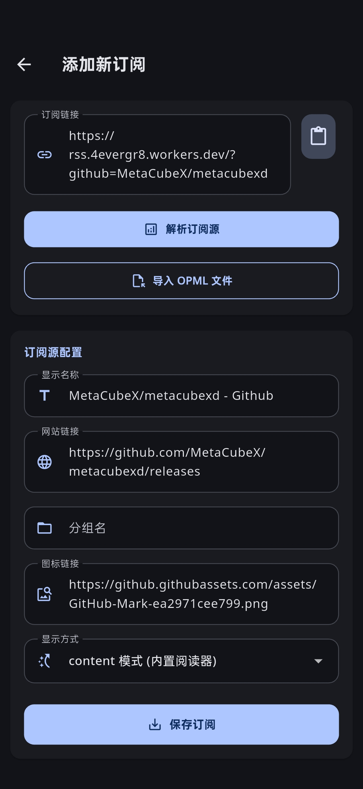

# RSSQlite3

  

<h3 align="center">RSSQlite3</h3>

  基于Flutter框架的RSS阅读器 
  支持导入导出OPML 导出SQlite3 
  <a href="https://github.com/4evergr8/rss/issues/new">🐞故障报告</a>
  ·
  <a href="https://github.com/4evergr8/rss/issues/new">🏹功能请求</a>

## 目录

- [主要功能](#主要功能)
- [Screenshots](#screenshots)
- [食用方法](#食用方法)
- [配置文件](#配置文件)
- [引用](#引用)

## 主要功能

- 添加RSS订阅
- 下拉刷新所有订阅,优先更新长时间未更新的订阅
- 支持显示文章内容和在浏览器打开
- 支持导出所有数据为SQlite3数据库
- 切换未读,已读,星标

## Screenshots

<table>
  <tr>
    <td width="25%"></td>
    <td width="25%"></td>
    <td width="25%"></td>
    <td width="25%"></td>
  </tr>
</table>  

## 食用方法

1. 前往[Release](https://github.com/4evergr8/mihomoR/releases)下载对应架构的APK
2. 右上角加号添加订阅或导入OPML文件,下拉刷新订阅
3. 右上角设置可删除和修改订阅

## 引用

- 本项目采用GitHub Action进行编译
- 软件界面参考[SmartRSS: RSS Reader & Podcast](https://play.google.com/store/apps/details?id=com.vinsonguo.flutter_rss_reader)
- 自建RSS订阅[4evergr8/WorkerRSS](https://github.com/4evergr8/WorkerRSS)

